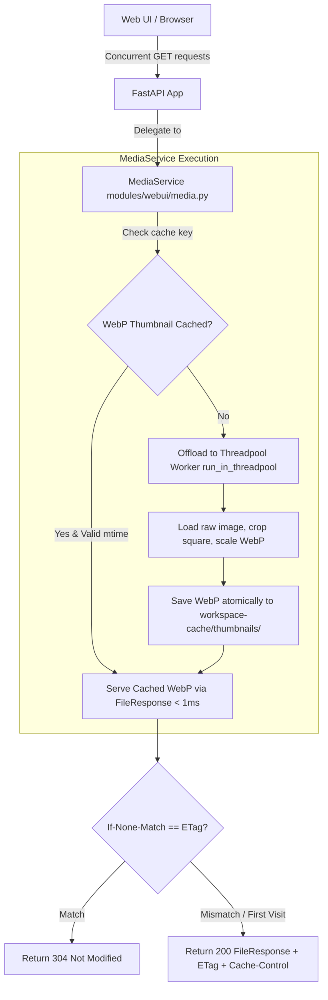

# Centralized MediaService & Concurrent Image Serving Design

**Date:** 2026-07-26  
**Status:** Approved  
**Goal:** Eliminate single-threaded event loop blocking during image downloads/thumbnail rendering in OneTrainer Web UI, unify image serving across all FastAPI routers (`datasets`, `concepts`, `gallery`), implement persistent WebP disk thumbnail caching, and add HTTP ETag / 304 / Cache-Control validation.

---

## 1. Problem Statement

1. **Async Event Loop Blocking:** Handlers like `GET /api/datasets/image` and `GET /api/concepts/preview-image` are declared as `async def`. Inside these functions, CPU-bound image operations (`load_image`, `Image.crop`, `Image.resize`, PNG encoding) run synchronously directly on FastAPI's main asyncio event loop. When a page requests 20+ thumbnails in parallel, requests execute sequentially on a single thread, blocking all Web UI HTTP traffic.
2. **On-the-Fly CPU & Encoding Overhead:** Thumbnail endpoints re-read full-resolution raw images from disk, scale them, and encode them to uncompressed PNGs in-memory on every request without caching.
3. **Fragmented Route Implementations:** Routers (`datasets.py`, `concepts.py`, `gallery.py`) implement ad-hoc image file reading, header generation, and error handling independently.

---

## 2. Proposed Architecture

### Components

#### A. `MediaService` (`modules/webui/media.py`)
* **Registration:** Instantiated on `AppState.media_service`.
* **Thumbnail Directory:** `<root_dir>/workspace-cache/thumbnails/`.
* **Cache Key Computation:** SHA-256 hash of `f"{resolved_source_path}:{mtime}:{file_size}:{width}:{height}:{crop_square}"`.
* **Methods:**
  - `get_thumbnail_file(source_path: Path, width: int = 150, height: int = 150, crop_square: bool = True) -> tuple[Path, str, str]`
    - Computes cache key hash and checks `<cache_dir>/<hash>.webp`.
    - If missing or source file modified, executes PIL crop/scale in worker thread, encodes WebP (`format="WEBP"`), and saves using `save_pil_atomic`.
    - Returns `(thumbnail_path, "image/webp", etag)`.
  - `async serve_image(request: Request, source_path: Path, thumb: bool = False, target_size: int = 150) -> Response`
    - Resolves image path (handling missing files with a 150x150 fallback placeholder).
    - Checks `If-None-Match` request header. If matching ETag, returns `Response(status_code=304)`.
    - Returns `FileResponse` with `ETag`, `Cache-Control: public, max-age=86400`, and `media_type`.

#### B. Router Integrations
* **`modules/webui/routers/datasets.py` (`GET /api/datasets/image`)**:
  Calls `app_state.media_service.serve_image(request, img_path, thumb=thumb)`.
* **`modules/webui/routers/concepts.py` (`GET /api/concepts/preview-image`)**:
  Calls `app_state.media_service.serve_image(request, img_path, thumb=True)`.
* **`modules/webui/routers/gallery.py` (`GET /api/gallery/runs/{run_key}/images/{filename}`)**:
  Calls `app_state.media_service.serve_image(request, image_path, thumb=False)`.

---

## 3. Concurrency & Performance Guarantees

1. **Non-Blocking Async Event Loop:** Image operations run via `starlette.concurrency.run_in_threadpool` or `asyncio.to_thread`.
2. **Parallel CPU Utilization:** Multiple worker threads process thumbnail requests simultaneously across CPU cores.
3. **WebP Efficiency:** WebP encoding is 5x–10x faster than PNG encoding and reduces payload bytes by ~80%.
4. **Sub-Millisecond Cache Hits:** Cached WebP files serve directly via kernel `sendfile` / `FileResponse` (< 1ms).

---

## 4. Verification Strategy

1. **Unit Tests (`tests/webui/test_media_service.py`)**:
   - Verify `MediaService` generates WebP thumbnails and returns valid ETag and 304 Not Modified responses.
   - Verify source file modification invalidates thumbnail cache.
   - Verify non-image/missing file requests return fallback placeholder cleanly without throwing exceptions.
2. **Integration Tests (`tests/webui/test_datasets_router.py`, `tests/webui/test_gallery_router.py`)**:
   - Verify `/api/datasets/image`, `/api/concepts/preview-image`, and `/api/gallery/runs/.../images/...` return WebP / image responses with `Cache-Control` and `ETag` headers.
3. **Frontend Verification**:
   - `bun run check && bun run test && bun run build`.
